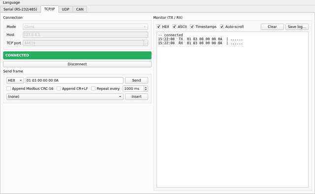
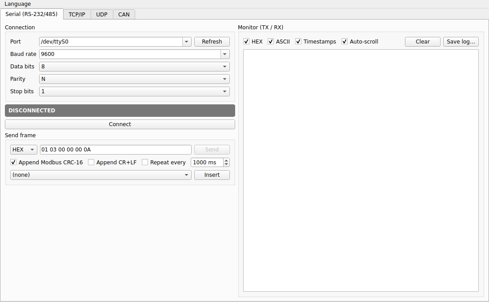
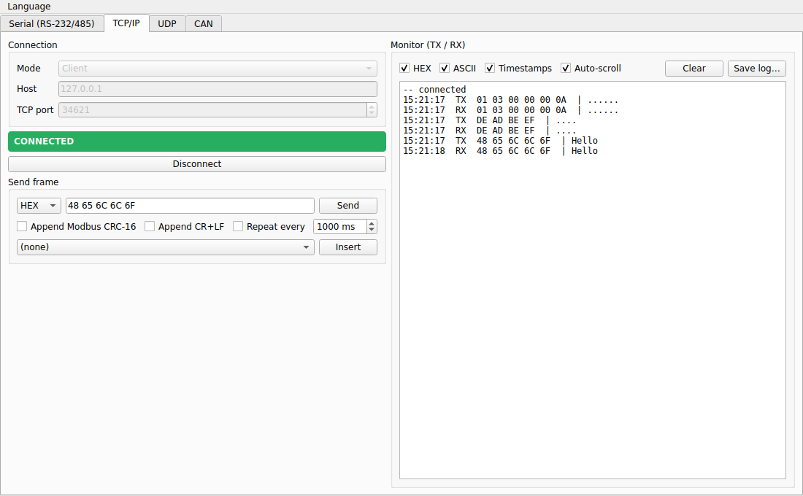
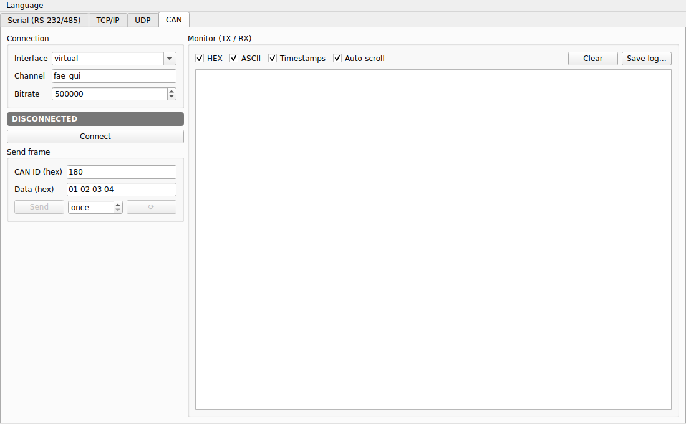
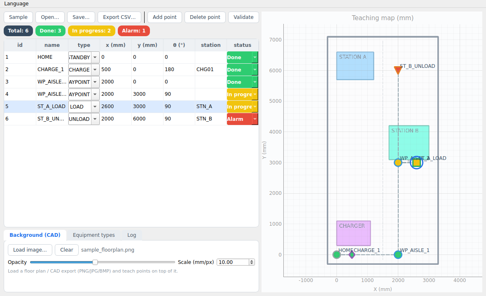
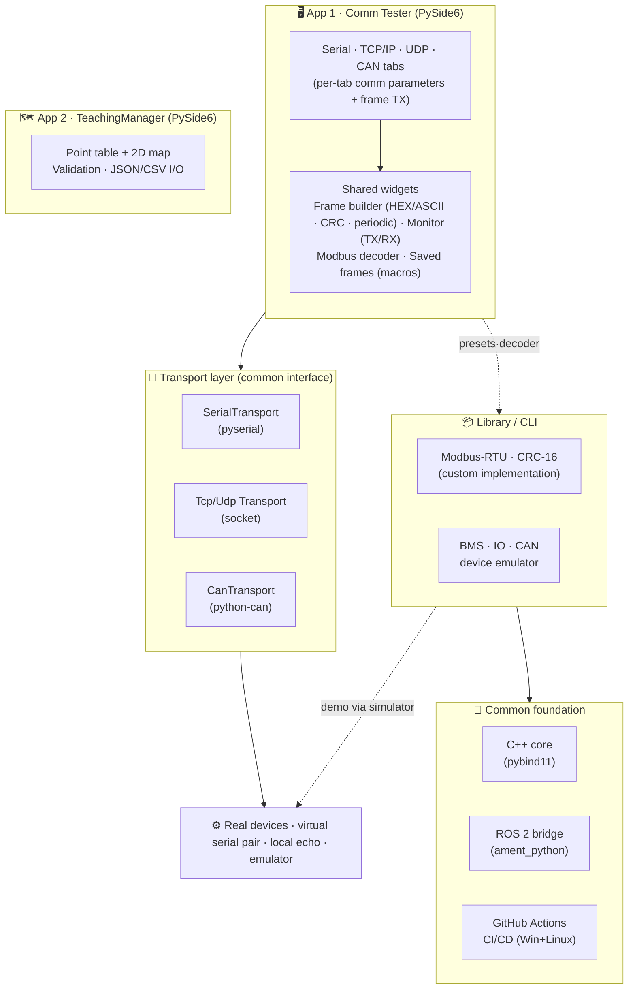

# FAE Toolkit

> 🌐 [한국어](README.md) (default) · **English**

> A **cross-platform (Windows · Linux) communication testing toolkit** for field engineers.
> For each communication type (Serial · TCP · UDP · CAN), **directly configure the parameters and TX/RX frames** to **communicate with real devices**,
> and manage AGV teaching points with the separate **TeachingManager** app. (Hercules / RealTerm / Docklight style)

[](https://github.com/bong7233/FAE_Toolkit_Bong/actions/workflows/ci.yml)


## 📚 Documentation

| Document | Contents |
|------|------|
| **[Usage (USAGE)](docs/USAGE.en.md)** | Installation · how to run (Comm Tester / TeachingManager / CLI), demoing without hardware |
| **[Development (DEVELOPMENT)](docs/DEVELOPMENT.en.md)** | From editing code → testing → **rebuilding (compiling)** → releasing |
| **[Portfolio (PORTFOLIO)](docs/PORTFOLIO.en.md)** | For interviews/submission — what to show and how to explain it |
| **[Hardware (HARDWARE)](docs/HARDWARE.en.md)** | Connecting real serial/CAN ports, virtual pairs, troubleshooting |

> All documents are provided in Korean (default) and English (`*.en.md`).

---

## Preview



> **Comm Tester** — On the TCP tab, connect to a real socket and directly enter HEX/ASCII frames to send;
> TX/RX is shown on the monitor with timestamps. (No fake values — if there is nothing to connect to, the connection fails.)

| Serial tab | TCP tab (real TX/RX) | CAN tab | TeachingManager |
|---|---|---|---|
|  |  |  |  |

## Design Principles

1. **Real connections** — If there is no port/socket/bus, the connection **fails**. No fake telemetry is injected automatically.
2. **User-defined frames** — **Directly enter HEX/ASCII** frames that differ per vendor, and enable options for automatic Modbus CRC-16 appending, CR+LF, and periodic transmission.
3. **Saved frames (macros)** — **Save and load frequently used frames per vendor** (JSON persistence). They are stored separately per tab (Serial/TCP/UDP), and a **default frame library is seeded on first run** (BMS read / remote IO read·write / ASCII, etc.).
4. **Receive interpretation** — The monitor's **Decode Modbus** option interprets transmissions as requests and receptions as responses, showing register/bit/exception/CRC status on a single line.
5. **Communication-type centric** — Serial / TCP / UDP / CAN tabs. Each tab exposes only the parameters for that communication type.
6. **Honest even without hardware** — Demo with a virtual serial pair (socat/com0com), local echo (TCP/UDP), CAN virtual, or the bundled **device emulator** (real TX/RX, not a fake dashboard).
7. **KO/EN toggle** — Switch languages from the menu (no mixed-language display).

## Components

| Module | Contents | Status |
|------|------|------|
| **Comm Tester** (app) | Serial/TCP/UDP/CAN tabs, direct frame entry, real connections, TX/RX monitor | ✅ |
| **TeachingManager** (app) | Separate program. 2D management/validation of teaching points/routes · JSON/CSV | ✅ |
| Protocol library | Custom implementation of Modbus-RTU / CRC-16 (reused by tab presets + emulator) | ✅ |
| Device emulator | BMS/IO/CAN simulator, `bms-sim-serve` (serves a fake slave on a real port) | ✅ |
| C++ core (+pybind11) | CRC/Modbus in C++17, byte-identity verified against Python | ✅ |
| ROS 2 bridge | Telemetry to ROS 2 topics (Linux, ament_python) | ✅ |

## Architecture



> On GitHub, the diagram above renders as an image. For a text summary, see the **[Components](#components)** table below.

## Download (Releases)

The **standalone executables** that run without (Python) installation are available from **[Releases](https://github.com/bong7233/FAE_Toolkit_Bong/releases)**.
When you push a `v*` tag, CI automatically builds the executables below for Windows·Linux and attaches them to the release.

| Executable | Description |
|---|---|
| `comm-tester-<os>` | Comm Tester GUI (Serial/TCP/UDP/CAN) |
| `teaching-manager-<os>` | TeachingManager GUI |
| `fae-toolkit-cli-<os>` | Headless CLI (emulator/demo) |

> For how to cut a new release, see **[Development › Release](docs/DEVELOPMENT.en.md)**.

## Quick Start

```bash
git clone https://github.com/bong7233/FAE_Toolkit_Bong.git
cd FAE_Toolkit_Bong
python -m venv .venv && source .venv/bin/activate   # Windows: .venv\Scripts\activate
pip install -e ".[gui,dev]"

fae-toolkit-gui      # Comm Tester (Serial/TCP/UDP/CAN)
teaching-manager     # TeachingManager (separate app)
```

### Demoing Without Hardware (the honest way)

```bash
# TCP/UDP: open two Comm Testers, one as Server and one as Client (or use local echo)
# Serial: virtual serial pair
socat -d -d PTY,link=/tmp/ttyA,raw,echo=0 PTY,link=/tmp/ttyB,raw,echo=0
fae-toolkit bms-sim-serve --port /tmp/ttyA --baudrate 115200   # serve a fake BMS slave on a real port
fae-toolkit-gui   # in the Serial tab connect /tmp/ttyB, then send '01 03 00 00 00 0A' + CRC
```

## Tech Stack

- **Languages/runtime**: Python 3.10+ (PySide6), C++17/CMake + pybind11
- **Communication**: pyserial (RS-232/485), socket (TCP/UDP), python-can (CAN), Modbus-RTU (custom implementation)
- **Quality/CI**: pytest, ruff, GitHub Actions (Windows+Linux matrix · C++ · pybind11 · ROS 2)

## Project Structure

```
src/fae_toolkit/
├── core/          transport(serial/tcp/udp), hexfmt, crc
├── protocols/     modbus, bms/io/can frame definitions (for presets·emulators)
├── sim/           device emulators (BMS/IO/CAN)
├── ui/            Comm Tester (comm/ tabs, i18n, app)
├── teaching_manager/  TeachingManager (separate app)
└── cli.py         headless demo/emulator entry point
cpp/               C++17 core (CRC/Modbus) + pybind11
ros2_bridge/       ROS 2 (ament_python) bridge
```

## Roadmap

- [x] Per-communication-type Comm Tester (Serial/TCP/UDP/CAN) — real connections + direct frame entry + monitor
- [x] KO/EN language toggle
- [x] TeachingManager split into a separate app
- [x] C++ core (+pybind11), ROS 2 bridge, CI/CD
- [x] Received-frame Modbus decoder — in the monitor, TX is interpreted as a request and RX as a response (register/bit/exception/CRC)
- [x] Saved frames (macros) — save and load frames per vendor (JSON persistence, separated per tab)
- [x] Bundled default frame library (BMS / IO / ASCII seed)
- [ ] User frame sequences (scenarios) execution — automatically send multiple frames in order

## Author

**이상봉 (Sangbong Lee)** — Robot S/W Engineer @ Zenix Robotics
- Portfolio: https://bongfae-production.up.railway.app/#about
- Email: batmantwo7233@gmail.com

## License

MIT — see [LICENSE](LICENSE).
