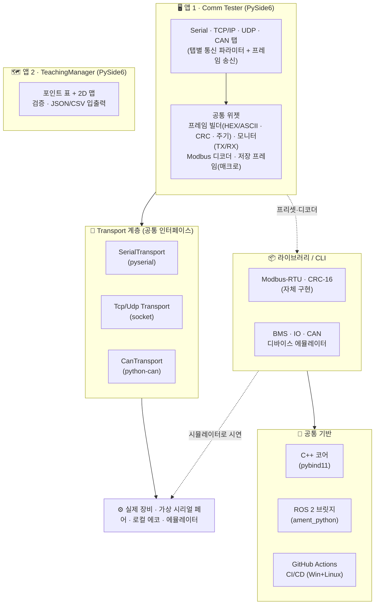

# FAE Toolkit

> 🌐 **한국어** (기본) · [English](README.en.md)

> 현장 엔지니어를 위한 **크로스플랫폼(Windows · Linux) 통신 테스트 도구 모음**.
> 통신 유형별(Serial · TCP · UDP · CAN)로 **파라미터와 송수신 프레임을 직접 설정**해 **실제 장비와 통신**하고,
> 별도 앱 **TeachingManager**로 AGV 티칭 포인트를 관리합니다. (Hercules / RealTerm / Docklight 스타일)

[](https://github.com/bong7233/FAE_Toolkit_Bong/actions/workflows/ci.yml)


## 📚 문서

| 문서 | 내용 |
|------|------|
| **[사용 가이드 (USAGE)](docs/USAGE.md)** | 설치 · 실행 방법 (Comm Tester / TeachingManager / CLI), 하드웨어 없이 시연 |
| **[개발 가이드 (DEVELOPMENT)](docs/DEVELOPMENT.md)** | 코드 수정 → 테스트 → **다시 빌드(컴파일)** → 릴리스까지 |
| **[포트폴리오 가이드 (PORTFOLIO)](docs/PORTFOLIO.md)** | 면접/제출용 — 무엇을 보여주고 어떻게 설명할지 |
| **[하드웨어 연동 (HARDWARE)](docs/HARDWARE.md)** | 실제 시리얼/CAN 포트 연결, 가상 페어, 문제 해결 |

> 모든 문서는 한글(기본)과 영어(`*.en.md`)로 제공됩니다.

---

## 미리보기


> **Comm Tester** — TCP 탭에서 실제 소켓에 연결하고, HEX/ASCII 프레임을 직접 입력해 송신하면
> 송수신이 타임스탬프와 함께 모니터에 표시됩니다. (가짜 값 없음 — 연결할 대상이 없으면 연결 실패)

| Serial 탭 | TCP 탭 (실제 송수신) | CAN 탭 | TeachingManager |
|---|---|---|---|
|  |  |  |  |

## 설계 원칙

1. **실제 연결** — 포트/소켓/버스가 없으면 연결이 **실패**합니다. 자동으로 주입되는 가짜 텔레메트리가 없습니다.
2. **사용자 정의 프레임** — 제조사마다 다른 프레임을 **HEX/ASCII로 직접 입력**하고, Modbus CRC-16 자동첨부·CR+LF·주기 송신 옵션을 켤 수 있습니다.
3. **저장 프레임(매크로)** — 자주 쓰는 프레임을 **제조사별로 저장·불러오기**(JSON 영속). 탭(Serial/TCP/UDP)별로 따로 보관되며, BMS 읽기 / 원격 IO 읽기·쓰기 / ASCII 등 **기본 프레임 라이브러리가 첫 실행 시 시드**됩니다.
4. **수신 해석** — 모니터의 **Decode Modbus** 옵션으로 송신은 요청, 수신은 응답으로 해석해 레지스터·비트·예외·CRC 상태를 한 줄로 보여줍니다.
5. **통신 유형 중심** — Serial / TCP / UDP / CAN 탭. 각 탭은 해당 통신의 파라미터만 노출합니다.
6. **하드웨어 없이도 정직하게** — 가상 시리얼 페어(socat/com0com), 로컬 에코(TCP/UDP), CAN virtual, 또는 동봉된 **디바이스 에뮬레이터**로 시연합니다(가짜 대시보드가 아니라 실제 송수신).
7. **KO/EN 토글** — 메뉴에서 언어 전환(혼합 표기 제거).

## 구성

| 모듈 | 내용 | 상태 |
|------|------|------|
| **Comm Tester** (앱) | Serial/TCP/UDP/CAN 탭, 프레임 직접입력, 실제연결, 송수신 모니터 | ✅ |
| **TeachingManager** (앱) | 별도 프로그램. 티칭 포인트/루트 2D 관리·검증·JSON/CSV | ✅ |
| 프로토콜 라이브러리 | Modbus-RTU / CRC-16 자체 구현 (탭의 프리셋 + 에뮬레이터에 재사용) | ✅ |
| 디바이스 에뮬레이터 | BMS/IO/CAN 시뮬레이터, `bms-sim-serve`(실제 포트에 가짜 슬레이브 서빙) | ✅ |
| C++ 코어 (+pybind11) | CRC/Modbus를 C++17로, Python과 바이트 동일성 검증 | ✅ |
| ROS 2 브릿지 | 텔레메트리를 ROS 2 토픽으로 (Linux, ament_python) | ✅ |

## 아키텍처



> GitHub에서는 위 다이어그램이 그림으로 렌더링됩니다. 텍스트 요약은 아래 **[구성](#구성)** 표를 참고하세요.

## 다운로드 (Releases)

설치(파이썬) 없이 쓰는 **단독 실행파일**은 **[Releases](https://github.com/bong7233/FAE_Toolkit_Bong/releases)** 에서 받습니다.
`v*` 태그를 푸시하면 CI가 아래 실행파일을 Windows·Linux용으로 자동 빌드해 릴리스에 첨부합니다.

| 실행파일 | 설명 |
|---|---|
| `comm-tester-<os>` | Comm Tester GUI (Serial/TCP/UDP/CAN) |
| `teaching-manager-<os>` | TeachingManager GUI |
| `fae-toolkit-cli-<os>` | 헤드리스 CLI(에뮬레이터/데모) |

> 릴리스를 새로 끊는 방법은 **[개발 가이드 › 릴리스](docs/DEVELOPMENT.md)** 참고.

## 빠른 시작

```bash
git clone https://github.com/bong7233/FAE_Toolkit_Bong.git
cd FAE_Toolkit_Bong
python -m venv .venv && source .venv/bin/activate   # Windows: .venv\Scripts\activate
pip install -e ".[gui,dev]"

fae-toolkit-gui      # Comm Tester (Serial/TCP/UDP/CAN)
teaching-manager     # TeachingManager (별도 앱)
```

### 하드웨어 없이 시연하기 (정직한 방법)

```bash
# TCP/UDP: Comm Tester를 2개 띄워 한쪽 Server, 한쪽 Client로 연결 (또는 로컬 에코)
# Serial: 가상 시리얼 페어
socat -d -d PTY,link=/tmp/ttyA,raw,echo=0 PTY,link=/tmp/ttyB,raw,echo=0
fae-toolkit bms-sim-serve --port /tmp/ttyA --baudrate 115200   # 가짜 BMS 슬레이브를 실제 포트에 서빙
fae-toolkit-gui   # Serial 탭에서 /tmp/ttyB 연결 후 '01 03 00 00 00 0A' + CRC 송신
```

## 기술 스택

- **언어/런타임**: Python 3.10+ (PySide6), C++17/CMake + pybind11
- **통신**: pyserial(RS-232/485), socket(TCP/UDP), python-can(CAN), Modbus-RTU(자체구현)
- **품질/CI**: pytest, ruff, GitHub Actions (Windows+Linux 매트릭스 · C++ · pybind11 · ROS 2)

## 프로젝트 구조

```
src/fae_toolkit/
├── core/          transport(serial/tcp/udp), hexfmt, crc
├── protocols/     modbus, bms/io/can 프레임 정의 (프리셋·에뮬레이터용)
├── sim/           디바이스 에뮬레이터 (BMS/IO/CAN)
├── ui/            Comm Tester (comm/ 탭들, i18n, app)
├── teaching_manager/  TeachingManager (별도 앱)
└── cli.py         헤드리스 데모/에뮬레이터 진입점
cpp/               C++17 코어 (CRC/Modbus) + pybind11
ros2_bridge/       ROS 2 (ament_python) 브릿지
```

## 로드맵

- [x] 통신 유형별 Comm Tester (Serial/TCP/UDP/CAN) — 실제연결 + 프레임 직접입력 + 모니터
- [x] KO/EN 언어 토글
- [x] TeachingManager 별도 앱 분리
- [x] C++ 코어(+pybind11), ROS 2 브릿지, CI/CD
- [x] 수신 프레임 Modbus 디코더 — 모니터에서 TX는 요청, RX는 응답으로 해석(레지스터/비트/예외/CRC)
- [x] 저장 프레임(매크로) — 제조사별로 프레임을 저장·불러오기(JSON 영속, 탭별 분리)
- [x] 기본 프레임 라이브러리 동봉 (BMS / IO / ASCII 시드)
- [ ] 사용자 프레임 시퀀스(시나리오) 실행 — 여러 프레임을 순서대로 자동 송신

## 저자

**이상봉 (Sangbong Lee)** — Robot S/W Engineer @ Zenix Robotics
- Portfolio: https://bongfae-production.up.railway.app/#about
- Email: batmantwo7233@gmail.com

## 라이선스

MIT — [LICENSE](LICENSE) 참조.
