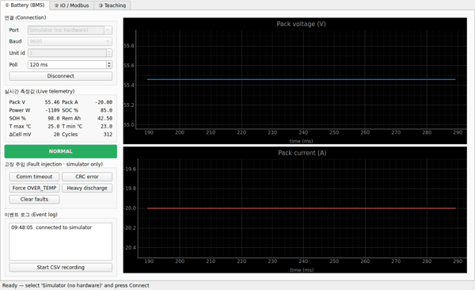
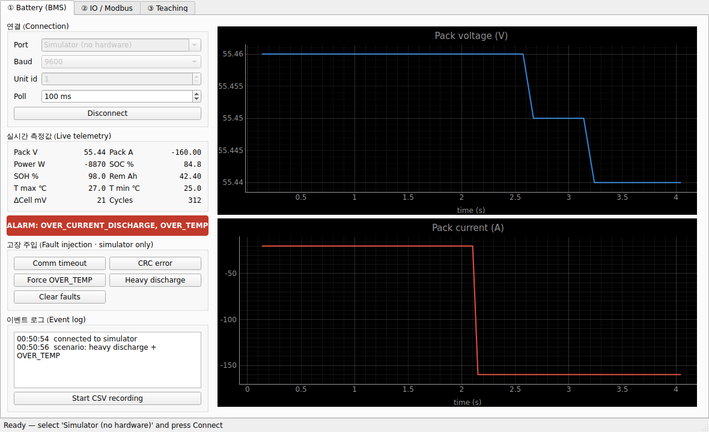
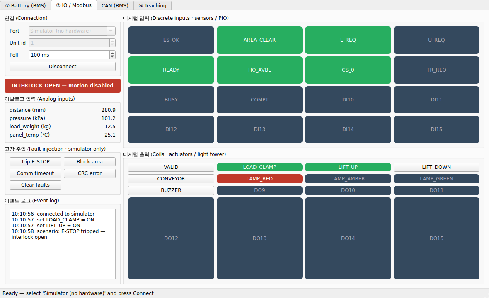

# FAE Toolkit

> 산업용 장비 통신 진단을 위한 **크로스플랫폼(Windows · Linux) 데스크톱 툴킷**.
> AGV/AMR 물류로봇 현장에서 실제로 수행한 업무 — 배터리(BMS) 통신, IO/Modbus 진단,
> 티칭 포인트 관리 — 를 **재현 가능한 도구**로 만든 Field Application Engineer 포트폴리오입니다.

[](https://github.com/bong7233/FAE_Toolkit_Bong/actions/workflows/ci.yml)


---

## 미리보기



> 라이브 데모 — 내장 시뮬레이터 연결 → 실시간 전압/전류 트렌드 → 고장 주입으로 알람까지(하드웨어 없이).



> ① 배터리(BMS) 통신 테스트 모듈 — 내장 시뮬레이터에 연결해 실시간 전압/전류 트렌드를 보고,
> 고장 주입(과전류·과온)으로 알람을 시연한 화면.



> ② IO/Modbus 통신 테스트 모듈 — 디지털 입력(센서/PIO)·출력(액추에이터/시그널타워)·아날로그를
> 진단하고, **인터락**을 시연한 화면(E-STOP 트립 → 모션 출력 거부, 빨간 시그널). 하드웨어 없이 실행됩니다.


> ③ 티칭 포인트 관리(심화) — 노드/루트를 2D 맵으로 시각화하고, 포인트(Load/Unload/Charge 등)를
> 편집하며, JSON/CSV로 입출력하고, 검증(중복·미연결·Load/Unload 누락 등)을 수행하는 화면.

## 왜 이 프로젝트인가

현장 통신 테스트 도구는 **실제 시리얼/CAN 포트를 OS 레벨에서 점유**해야 하므로 웹앱으로 만들 수 없습니다.
그래서 이 툴킷은 네이티브 데스크톱 앱이며, 다음 세 가지를 동시에 증명하도록 설계했습니다.

1. **현장 실무성** — 모든 모듈이 실제 BMS/IO 매뉴얼 기반의 요청·응답·파싱·알람 흐름을 그대로 구현합니다.
2. **하드웨어 없는 재현성** — 모든 통신 모듈에 **장비 시뮬레이터**가 함께 들어있어, 장비 없이도 누구나 클릭 한 번으로 실행·평가할 수 있습니다. 실제 가상 시리얼 포트(Linux `socat` / Windows `com0com`)에 물리면 *진짜 포트 경로 그대로* 동작합니다.
3. **크로스플랫폼 + CI/CD** — GitHub Actions가 **Windows·Linux 양쪽 러너**에서 매 푸시마다 테스트하고, 태그를 붙이면 양 OS 실행파일을 자동 빌드/배포합니다. (위 CI 배지가 그 증거입니다.)

## 구성

| 모듈 | 내용 | 상태 |
|------|------|------|
| ① 배터리(BMS) 통신 테스트 | 요청 프레임 송신 → 응답 수신·파싱 → 전압/전류/SOC/온도/알람 실시간 표시·로깅, 고장 주입 | ✅ 동작 (CLI+GUI, 시뮬레이터) |
| ② IO / Modbus 통신 테스트 | 디지털/아날로그 IO 읽기·쓰기, PIO·인터락 조건 진단 | ✅ 동작 (CLI+GUI, 시뮬레이터) |
| ③ 티칭 포인트 관리(심화) | 노드/루트·Load/Unload 포인트 관리·2D 시각화·검증·Import/Export | ✅ 동작 (GUI 2D 맵, JSON/CSV) |
| CAN BMS (broadcast) | python-can 가상 버스로 주기 텔레메트리 디코딩 | ✅ 동작 (CLI, 시뮬레이터) |
| C++ 코어 (CMake) | CRC/Modbus 코어를 C++17로 구현, 양 OS 빌드/테스트 | ✅ 동작 (CMake+CTest, 양 OS CI) |
| ROS2 브릿지 | 텔레메트리를 ROS2 토픽으로 퍼블리시 (Linux) | ✅ 동작 (ament_python, colcon CI) |

## 아키텍처

```
┌─────────────────────────────────────────────────────────┐
│                 UI 계층 (PySide6 / Qt)                    │  ← 데스크톱 GUI
├─────────────────────────────────────────────────────────┤
│  도메인/서비스 계층 (poller, 알람, 로깅, CSV export)       │  ← GUI 없이 테스트 가능
├───────────────────────────┬─────────────────────────────┤
│   프로토콜 코덱 (framing,  │     장비 시뮬레이터          │
│   CRC, 레지스터 맵, parse) │  (BMS/IO 가상 디바이스 +     │
│                           │   고장 주입)                 │
├───────────────────────────┴─────────────────────────────┤
│         전송 계층 (Transport 추상화)                      │
│   • SerialTransport (pyserial, 실제 포트)                 │
│   • LoopbackTransport (인프로세스, 하드웨어 불필요)        │
└─────────────────────────────────────────────────────────┘
```

핵심 설계 원칙: **통신/프로토콜 로직을 GUI와 완전히 분리**하여, 대부분의 로직을 디스플레이 없이 `pytest`로 검증합니다(CI 친화적). GUI는 얇은 표현 계층입니다.

## 빠른 시작

### 설치
```bash
git clone https://github.com/bong7233/FAE_Toolkit_Bong.git
cd FAE_Toolkit_Bong
python -m venv .venv

# Linux/macOS
source .venv/bin/activate
# Windows (PowerShell)
# .venv\Scripts\Activate.ps1

pip install -e ".[gui,dev]"
```

### 하드웨어 없이 데모 실행 (시뮬레이터)
```bash
# 헤드리스 데모 (콘솔, 하드웨어 불필요)
fae-toolkit bms-demo        # 배터리(Modbus) 텔레메트리 + 고장 주입
fae-toolkit io-demo         # IO/PIO 인터락 시나리오
fae-toolkit can-demo        # CAN BMS 브로드캐스트 (python-can 가상 버스)
fae-toolkit teaching-demo   # 티칭 프로젝트 생성·검증

# 데스크톱 GUI
fae-toolkit-gui
```

### 실제 포트로 사용 (현업)
실제 장비에 바로 연결하거나, 가상 시리얼 페어로 "진짜 포트" 경로를 시연할 수 있습니다.
```bash
# 실제 장비
fae-toolkit bms-demo --port /dev/ttyUSB0 --baudrate 9600   # (Windows: --port COM3)

# 하드웨어 없이 실제 포트 경로 시연 (Linux, socat)
socat -d -d PTY,link=/tmp/ttyA,raw,echo=0 PTY,link=/tmp/ttyB,raw,echo=0
fae-toolkit bms-sim-serve --port /tmp/ttyA --baudrate 115200   # 시뮬레이터를 디바이스로 서빙
fae-toolkit bms-demo      --port /tmp/ttyB --baudrate 115200   # 앱으로 연결
```
시뮬레이터를 한쪽 포트에 띄우고 앱을 다른 쪽에 연결하면 실제 RS232/RS485와 **동일한 pyserial 경로**로
동작합니다(이 흐름은 CI의 `test_serial_socat`이 자동 검증). 자세한 내용은 **[docs/HARDWARE.md](docs/HARDWARE.md)** 참고.

## 기술 스택

- **언어/런타임**: Python 3.10+ (주력), C++17/CMake + pybind11 (CRC·Modbus 코어 + Python 연동)
- **GUI**: PySide6 (Qt 6) + pyqtgraph (실시간 플롯)
- **통신**: pyserial (RS232/RS485), Modbus RTU (자체 구현), CAN (python-can)
- **ROS 2**: rclpy 브릿지 노드 (Humble, ament_python) — 리눅스
- **품질**: pytest, ruff(lint/format)
- **CI/CD**: GitHub Actions (Windows + Linux 매트릭스 · C++ · pybind11 · ROS 2), PyInstaller 패키징

## 프로젝트 구조

```
src/fae_toolkit/
├── core/          전송 추상화(serial/loopback), framing, CRC, 로깅
├── protocols/     장비 프로토콜 코덱 (bms, io ...)
├── sim/           장비 시뮬레이터 (가상 디바이스 + 고장 주입)
├── services/      poller·알람·CSV 등 GUI 비의존 서비스
├── ui/            PySide6 데스크톱 앱
└── cli.py         헤드리스 데모/자동화 진입점
tests/             pytest (하드웨어 불필요)
cpp/               C++17 프로토콜 코어 (CRC/Modbus) + CMake/CTest
ros2_bridge/       ROS2(ament_python) 브릿지 — BMS/IO → ROS2 토픽
.github/workflows/ CI/CD
```

## 로드맵

- [x] ① 배터리(BMS) 모듈: 코덱 + 시뮬레이터 + CLI + GUI
- [x] CI: Windows·Linux 테스트 매트릭스 + 오프스크린 GUI 스모크
- [x] CD: 태그 시 양 OS 실행파일 자동 빌드/릴리스 (워크플로우 구성)
- [x] ② IO/Modbus 모듈: 코덱(coils/DI/AI) + 인터락 시뮬레이터 + CLI + GUI
- [x] ③ 티칭 포인트 관리(심화): 모델/검증 + 2D 맵 GUI + JSON/CSV
- [x] CAN BMS 모듈 (python-can 가상 버스, CLI + 테스트)
- [x] C++ 프로토콜 코어(CRC/Modbus) + CMake + CTest (양 OS CI)
- [x] C++ ↔ Python pybind11 연동 (양 OS CI, Python과 바이트 동일성 검증)
- [x] ROS2 브릿지 노드 (ament_python, colcon CI)

## 저자

**이상봉 (Sangbong Lee)** — Robot S/W Engineer @ Zenix Robotics
AGV/AMR 물류자동화 로봇 운영 소프트웨어 개발 · 현장 셋업/티칭/장애분석
- Portfolio: https://bongfae-production.up.railway.app/#about
- Email: batmantwo7233@gmail.com

## 라이선스

MIT — [LICENSE](LICENSE) 참조.
